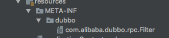
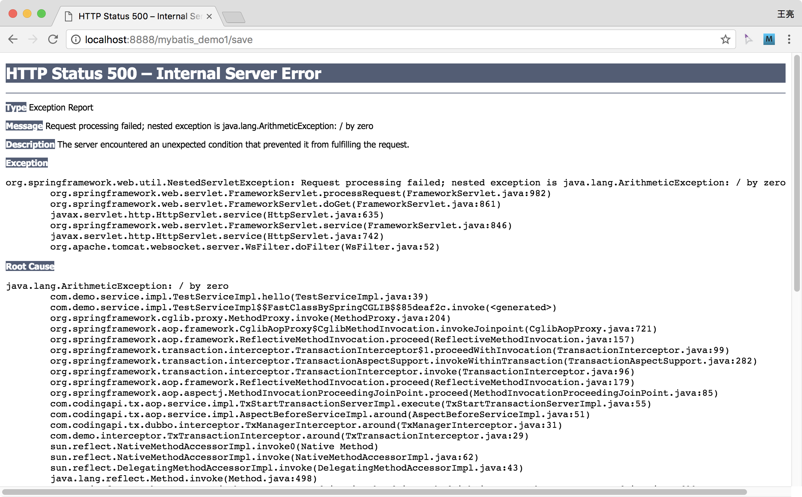

# dubbo LCN分布式事务示例v4.0 示例demo


## 项目介绍

demo项目下分为jdbc/mybatis/hibernate 三种版本的demo，可根据自己的项目需求来对应查看相关的demo

其中jdbc版本的demo涉及到了5个模块的调用，他们的调用关系图如下：


mybatis/hibernate 版本的demo只有两个模块，他们的调用关系图如下:


## 依赖的环境

dubbo-lcn-demo 需要依赖的环境有：

1. TxManager
2. Mysql
3. Redis
4. Eureka
5. Zookeeper

TxManager的启动与配置见：

[TxManager启动说明](https://github.com/codingapi/tx-lcn/wiki/TxManager%E5%90%AF%E5%8A%A8%E8%AF%B4%E6%98%8E)

* TxManager启动说明中包含Eureka的配置环境


## 数据库配置与设置


```
#数据库链接配置
db.url=jdbc:mysql://127.0.0.1:3306/test?useUnicode=true&characterEncoding=utf8
db.username = root
db.password = root
```


数据库为test，账号密码为root/root，使用者可根据自己的环境调整。

数据库的初始化脚本


```
USE test;

DROP TABLE IF EXISTS `t_test`;

CREATE TABLE `t_test` (
  `id` int(11) unsigned NOT NULL AUTO_INCREMENT,
  `name` varchar(50) DEFAULT NULL,
  PRIMARY KEY (`id`)
) ENGINE=InnoDB DEFAULT CHARSET=latin1;


```


## dubbo-lcn 配置教程

1. 添加maven依赖。请及时关注maven中心库的最新版本，尽量使用最新版本。

```
     <dependency>
        <groupId>com.codingapi</groupId>
        <artifactId>transaction-dubbo</artifactId>
        <version>1.0.0</version>
    </dependency>

    <dependency>
        <groupId>com.codingapi</groupId>
        <artifactId>tx-plugins-db</artifactId>
        <version>1.0.0</version>
    </dependency>

```

2. 设置代理连接池

```
    <!--mysql-->
    <bean name="dataSource" class="com.alibaba.druid.pool.DruidDataSource" init-method="init" destroy-method="close">
        <property name="url" value="jdbc:mysql://127.0.0.1:3306/test?useUnicode=true&amp;characterEncoding=utf8"/>
        <property name="username" value="root"/>
        <property name="password" value="root"/>
        <!-- 初始化连接大小 -->
        <property name="initialSize" value="5"/>
        <!-- 连接池最大并发使用连接数量 -->
        <property name="maxActive" value="50"/>
        <!-- 连接池最小空闲 -->
        <property name="minIdle" value="1"/>
        <!-- 获取连接最大等待时间 -->
        <property name="maxWait" value="60000"/>
        <!-- 打开pscache功能  在mysql5.5以上版本支持 -->
        <property name="poolPreparedStatements" value="true"/>
        <!-- 指定每个连接上的pscache的大小 -->
        <property name="maxPoolPreparedStatementPerConnectionSize" value="33"/>
        <property name="validationQuery" value="select 1"/>
        <property name="testOnBorrow" value="false"/>
        <!-- 归还连接时执行validationQuery  ，检测是否有效，设置为true这样会降低性能 -->
        <property name="testOnReturn" value="false"/>
        <!-- 申请链接的时间是否检测 -->
        <property name="testWhileIdle" value="true"/>
        <!-- 配置间隔多久才进行一次检测，检测需要关闭的空闲连接，单位是毫秒 -->
        <property name="timeBetweenEvictionRunsMillis" value="60000"/>
        <!-- 配置一个连接在池中最小生存的时间，单位是毫秒 -->
        <property name="minEvictableIdleTimeMillis" value="25200000"/>
        <!-- 打开超过时间限制是否回收功能 -->
        <property name="removeAbandoned" value="true"/>
        <!-- 超过多长时间 1800秒，也就是30分钟 -->
        <property name="removeAbandonedTimeout" value="1800"/>
        <!-- 关闭abanded连接时输出错误日志 -->
        <property name="logAbandoned" value="true"/>
        <!-- 监控数据库 -->
        <property name="filters" value="stat"/>
        <!--<property name="filters" value="mergeStat"/>-->
        <!-- 慢sql监控 10毫秒 -->
        <!--<property name="connectionProperties" value="druid.stat.slowSqlMillis=10" />-->
    </bean>


    <!-- LCN的代理连接池 -->
    <bean name="lcnDataSourceProxy" class="com.codingapi.tx.datasource.relational.LCNTransactionDataSource">
        <property name="dataSource" ref="dataSource"/>
        <property name="maxCount" value="20"/>
    </bean>


    <!-- 注入LCN的代理连接池 -->
    <bean id="transactionManager"
          class="org.springframework.jdbc.datasource.DataSourceTransactionManager">
        <property name="dataSource" ref="lcnDataSourceProxy" />
    </bean>


    <tx:annotation-driven order="2" transaction-manager="transactionManager"/>
    


```


3. 添加tx.properties配置

```

#txmanager地址
url=http://127.0.0.1:8899/tx/manager/

```


4. 添加切面事务拦截与order级别

```
package com.demo.interceptor;

import com.codingapi.tx.dubbo.interceptor.TxManagerInterceptor;
import org.aspectj.lang.ProceedingJoinPoint;
import org.aspectj.lang.annotation.Around;
import org.aspectj.lang.annotation.Aspect;
import org.springframework.beans.factory.annotation.Autowired;
import org.springframework.core.Ordered;
import org.springframework.stereotype.Component;
 
@Aspect
@Component
public class TxTransactionInterceptor  implements Ordered{

    @Autowired
    private TxManagerInterceptor txManagerInterceptor;

    @Override
    public int getOrder() {
        return 1;
    }

    @Around("execution(* com.demo.service.impl.*Impl.*(..))")
    public Object around(ProceedingJoinPoint point)throws Throwable{
        return txManagerInterceptor.around(point);
    }
}


```

5. 配置dubbo


```
    
    <dubbo:application name="mybatis_demo1"   />

    <!--所有参与分布式事务的模块以及TxManager都必须要在同一个服务下-->
    <dubbo:registry protocol="zookeeper" address="127.0.0.1:2181" />

    <!--只要存在远程调用其他模块都需添加Filter配置-->
    <dubbo:consumer  filter="transactionFilter" />

    <!--LCN框架读取dubbo配置，因此必须要填写该配置信息-->
    <dubbo:provider delay="-1" timeout="6000" port="20881"  retries="0"/>

    <dubbo:reference interface="com.demo.service.Test2Service" id="test2Service" />

    <dubbo:protocol accesslog="true" name="dubbo"  host="127.0.0.1" />

```

filer 路径/META-INF/dubbo/com.alibaba.dubbo.rpc.Filter

内容为：

```
transactionFilter=com.codingapi.tx.dubbo.filter.TransactionFilter

```




6. 添加com.codingapi.tx包路径的bean扫描

```
    <context:component-scan base-package="com.codingapi.tx.*"/>

```

## 启动说明

所有的demo启动以后的访问地址都是. 该项目下的demo1 都是web项目需要基于Tomcat等web容器启动，其他的demo均在main包run的方式启动。

http://localhost:port/projectName/save

请求以后会出现 / by zero异常。这是由于在demo1的最后一句代码上写有int v = 100/0;

 

此时观察数据你会发现没有任何数据，当把这句代码注释掉以后再执行时，将会看到两条数据。
